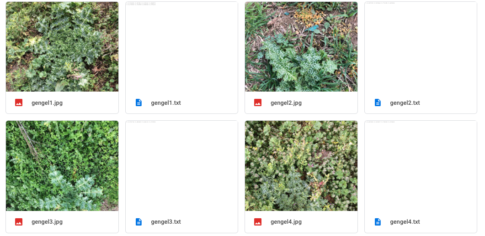

# gengel-detection-yolov3

YOLO is well known and famous object detector. In this study we used YOLOv3 to detect cardoon on an image(video or even live video)

1. we prepared dataset consist of 80 images of cardoon which are taken from the field.
3. Trained a YOLOv3 model with that custom dataset on  tool
4. Saved these trained weights to try on test video

</img>

and then we tested our trained model on a video file:

* reading input video
* loading YOLOv3 Network with pretrained weights
* Reading video frames in the loop
* getting blob from the frame
* implementing forward pass
* getting bounding boxes
* non-maximum supression
* drawing bounding boxes and adding text to that box
* writing processed frames to a new video file

</img>
